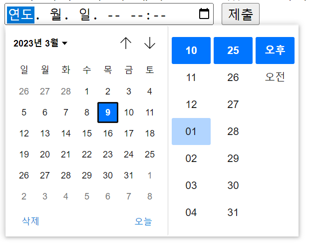

# Carbon::now() vs datatime-local

`<input type="datatime-local">` 

속성값에 연도(year), 월(month), 일(day)과 시간(hour, minute)을 정의할 수 있는 입력 필드이다.

이 값을 form 을 통해 보내면

UTC형식의 date 타입의 값이 넘어간다.

`-> 2023-03-09T22:30`

---

**Carbon** class

PHP Datatime 클래스를 확장하여 날짜와 시간을 쉽게 다룰수 있는 라이브러리 laravel에는 기본 포함.

`Carbon::now()` 현재 시간을 생성

---

